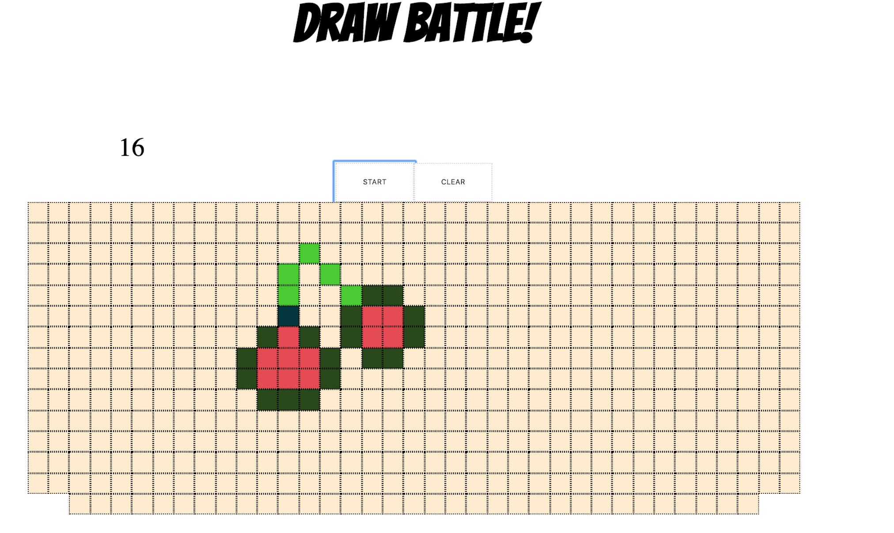

This activity was part of my curriculum challenges from Web Development Course at Enspiral Dev Academy.

This project is a result of a Friday group project in which 5 students, aim to deliver a project based on the learning of the week with maximun of 6 coding hours.

# Draw Battle

This project is a game where the user battles against the timer to draw.
We offer a prompt for the user to follow and the rules are:
1. Push the start button to start the timer. You have 30 seconds to art it up!
2. One click is to just input a color
3. And double-click is to change color
4. Right click to delete

 
 
 # Technologies
 React, Knex.js
